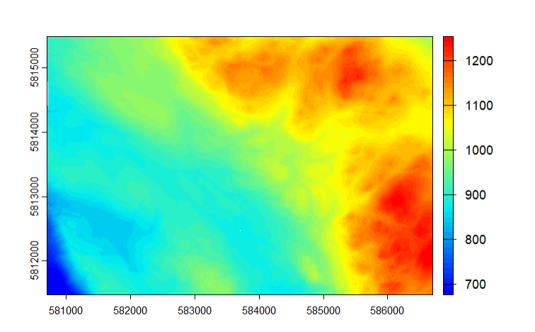
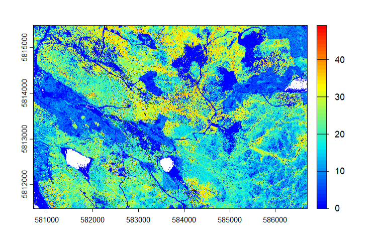
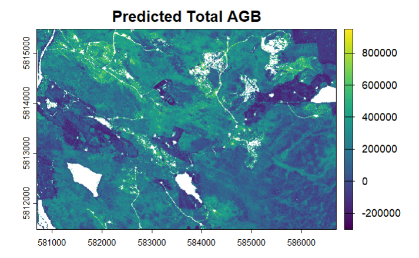
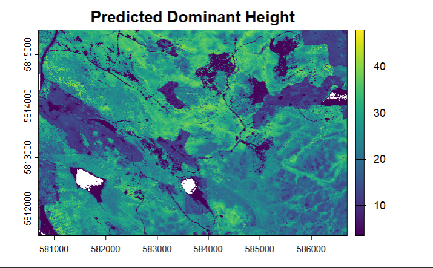

#### Overview

In this advanced remote sensing lab, raw lidar point cloud data was used to predict Above Ground Biomass (AGB) and dominant tree height across Alex Fraser Research Forest (AFRF). The workflow involved cleaning and processing the LiDAR data using the lidR package, generating key products such as Digital Elevation Models (DEMs) and Canopy Height Models (CHMs), and calculating plot-level LiDAR metrics. These metrics were then used to develop a statistical model, which was applied to produce wall-to-wall predictions of AGB and dominant tree height across the forest.

#### Basic Lidar Processing

The raw LiDAR point cloud data, provided as multiple .las tiles, were loaded into a LAS catalog to enable processing all tiles together. The dataset was inspected for quality issues, and duplicate points were removed to ensure accurate analysis.

```{r, eval=FALSE}
library(lidR)

# Create LAScatalog object from AFRF las tiles
cat_afrf <- readLAScatalog("Data/LAS")

# Inspect the LAScatalog for potential issues
las_check(cat_afrf)

# Remove duplicate points to improve processing efficiency
filtered_cat_afrf <- filter_duplicates(cat_afrf)
```


#### Ground and Canopy Modeling

Next, a Digital Elevation Model (DEM) was generated to represent the ground surface, allowing separation of ground points from vegetation and other non-ground features. The DEM was created using the tin() algorithm and rasterize_terrain() function. Because the raw LiDAR data was not normalized, the DEM was used to normalize the point cloud, which was then used to produce a Canopy Height Model (CHM) using the p2r (point-to-raster) method.


```{r, eval=FALSE}
#Create DEM with tin algorithm
dem_afrf <- rasterize_terrain(filtered_cat_afrf, 2, tin())

#normalize all tiles in cat_afrf with the DEM 
norm_tiles_afrf <- normalize_height(filtered_cat_afrf, dem_afrf)

#Create CHM for all normalized AFRF Tiles using p2r algorithm
chm_afrf <- rasterize_canopy(norm_cat_afrf, 2, p2r()) 

```



*Figure 1: Digital Elevation Model (DEM) of AFRF*



*Figure 2: Canopy Height Model (CHM) of AFRF*


#### Estimate Forest Attributes & Model Development

To estimate forest attributes, 38 plots were extracted across the study area, each with a radius of 30 meters. For each plot, a set of standard LiDAR metrics was calculated using the cloud_metrics() function from the lidR package. These metrics summarize key structural properties of the forest, including canopy height percentiles, variability in height, and point cloud density.

The resulting plot-level metrics were then used as predictors to develop statistical models for predicting Above-Ground Biomass (AGB) and dominant tree height. Models were built using forward selection with the add1() function, and the significance of each predictor was evaluated with an F-test. Collinearity was also considered, and highly correlated variables were excluded.

For AGB, the most significant predictors were zq90 (90th height percentile) and zentropy (canopy complexity). For dominant tree height, the most significant predictors were zq75 (75th height percentile) and pzabove2 (proportion of returns above 2 m).

Model 1 formula: Total_AGB = 609,811 + 16,293·zq90 - 975,484·zentropy
Model 2 formula: Dominant_Height = 3.55544 + 0.91019·zq95

These models were then applied to the full LiDAR dataset to generate wall-to-wall predictions of AGB and dominant tree height across the forest.


*Figure 3: Total Predicted Above Ground Biomass across AFRF*



*Figure 3: Total Predicted Dominant Height across AFRF*


