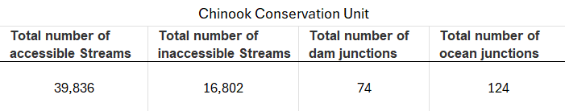
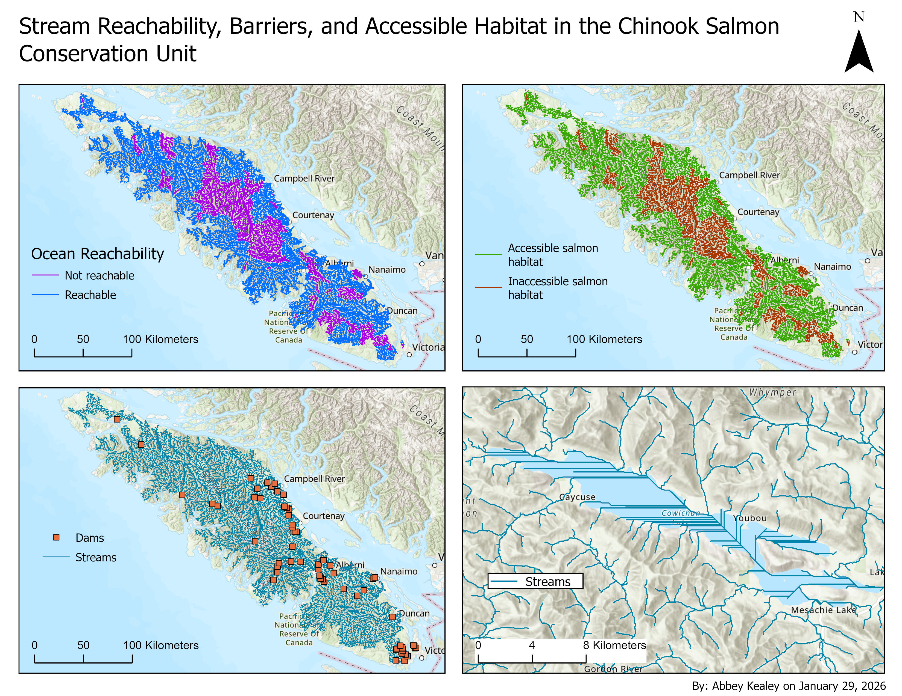

#### Overview

In this advanced GIS lab, spatial analysis was used to model stream networks and evaluate potential salmon spawning habitat on Vancouver Island. Using a Digital Elevation Model (DEM) in ArcGIS Pro, hydrological processes were simulated to derive a stream network and analyze the structure and connectivity of waterways across the island.

#### Workflow

The workflow involved generating hydrology layers from the DEM, converting streams to network routes, and incorporating dams as barriers within the system. Linear referencing and network tracing were then used to analyze stream attributes and determine which stream segments were accessible to salmon migrating from the ocean. Finally, spatial queries were used to identify stream segments with characteristics suitable for salmon spawning habitat based on accessibility, stream order, and slope gradient. Finally, the analysis was narrowed to the Chinook Conservation Unit to evaluate stream segments with characteristics suitable for Chinook salmon spawning habitat.

#### Results

The analysis identified 39,836 stream segments as accessible to Chinook salmon, while 16,802 segments were inaccessible (Table 1). Within the Chinook Conservation Unit, there were 74 dam junctions and 124 ocean junctions. Figure 1 visually illustrates which stream segments are reachable from the ocean and highlights potential barriers to migration.   

<figcaption style="font-size:0.8em;">
Table 1. Summary of Chinook salmon conservation unit stream network: total number of accessible and inaccessible streams, dam junctions, and ocean junctions.
</figcaption>

  

<figcaption style="font-size:0.8em;">
Figure 1. Stream reachability, barriers, and accessible habitat within the Chinook salmon conservation unit. Accessible and inaccessible stream segments are shown based on connectivity to the ocean, with dam junctions representing potential barriers and ocean junctions indicating access points for migrating salmon.
</figcaption> 
   
   
  
