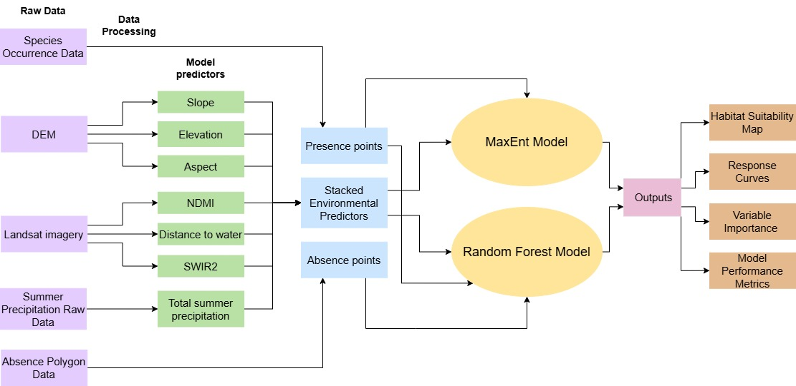
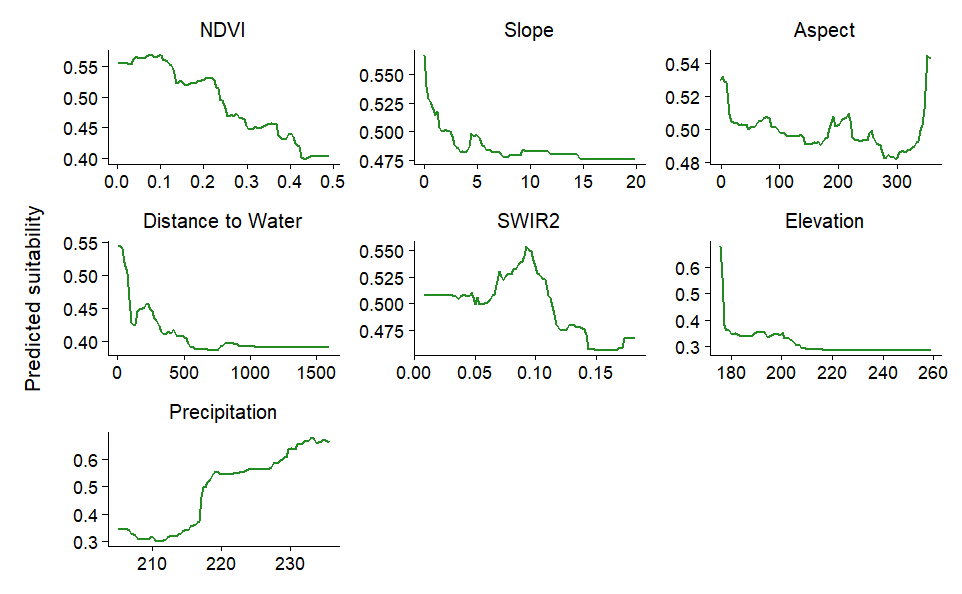
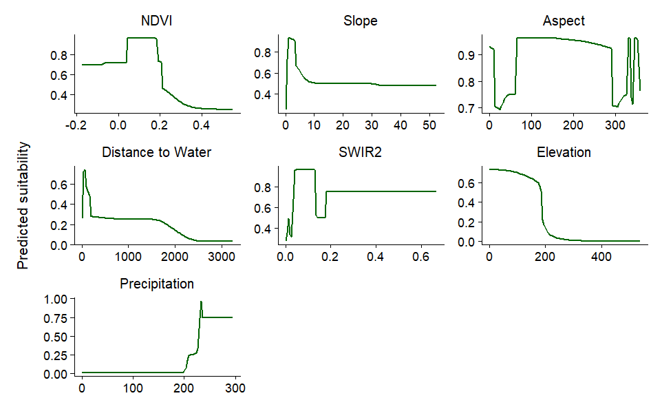
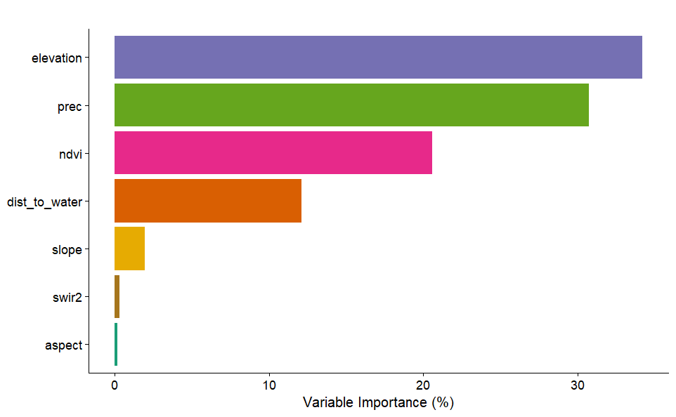
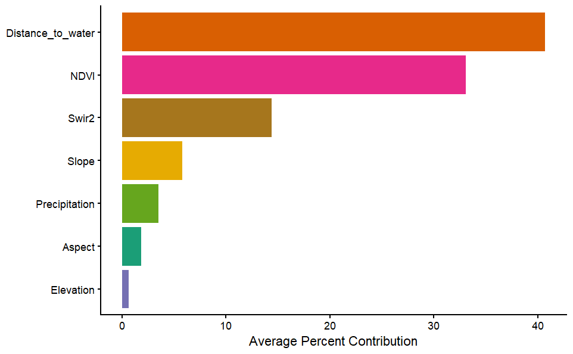
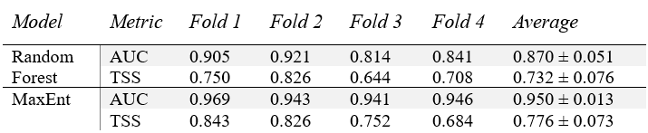

#### Overview

For my master’s capstone project, I modeled the habitat suitability of Stiff Yellow Flax, a rare herbaceous perennial plant restricted to the coastal marshes of Ontario’s Great Lakes region. This species is highly sensitive to fluctuating water levels, which are expected to increase with climate change, potentially affecting its survival and distribution. My project aimed to identify areas of suitable habitat across Eastern Georgian Bay (EGB) and determine which environmental factors most strongly influence the species’ distribution. I used two machine learning approaches: Random Forest, a presence–absence model, and MaxEnt, a presence-only model, to predict habitat suitability and evaluate key environmental drivers.

#### Methods

Species occurrence data were cleaned, filtered, and thinned to reduce sampling bias, resulting in 78 presence points. Absence data were generated from surveyed areas where the species was not detected, supplemented with pseudo-absences to capture a representative range of environmental conditions.

Environmental predictors included elevation, slope, aspect, vegetation health (NDVI), distance to shoreline, SWIR 2, and total summer precipitation Highly correlated variables (NDWI, NDMI and mean summer temperature) were removed to improve model interpretability. 

Both Random Forest and MaxEnt models were trained using spatial k-fold cross-validation to account for clustered occurrences. Random Forest incorporated presence and absence points, while MaxEnt used presence points and background points weighted by survey effort. Model performance was assessed using AUC and TSS, and variable importance was analyzed to identify the main drivers of habitat suitability. See Figure 1 for full workflow.

#### Results

Both models highlighted that most of Eastern Georgian Bay represents unsuitable habitat for Stiff Yellow Flax, with high suitability primarily concentrated along shoreline areas. The Random Forest model (Figure 2) predicted a broader gradient of suitability across inland regions, while MaxEnt (Figure 3) produced sharper contrasts between high and low suitability.

<figcaption style="font-size:0.9em; margin-bottom:1.5em; display:block;">
  Figure 2. Predicted habitat suitability for Stiff Yellow Flax across Eastern Georgian Bay from the Random Forest model. Suitability scores range continuously from 0 (unsuitable) to 1 (highly suitable).
</figcaption>

 
<figcaption style="font-size:0.9em; margin-bottom:1.5em; display:block;">
  Figure 3. Predicted habitat suitability for Stiff Yellow Flax across Eastern Georgian Bay from the MaxEnt model. Suitability scores range continuously from 0 (unsuitable) to 1 (highly suitable).
</figcaption>

Partial dependence plots from Random Forest (Figure 4) and Response curves from MaxEnt (Figure 5) show how habitat suitability varied with environmental conditions. Suitability generally increased with higher precipitation and NDVI, as well as with less steep slopes, lower elevations, and closer proximity to the shoreline. Moderate SWIR 2 reflectance also corresponded with higher suitability, and aspect had smaller, more variable effects. The models highlighted different key environmental drivers of habitat suitability. For Random Forest (Figures 6), elevation, precipitation, and NDVI were most influential, while for MaxEnt (Figures 7), distance to water, NDVI, and SWIR 2 reflectance were the primary predictors.

<figcaption style="font-size:0.9em; margin-bottom:1.5em; display:block;">
  Figure 4. Partial dependence plots from the Random Forest model showing the effect of each environmental predictor on the predicted habitat suitability of Stiff Yellow Flax across Eastern Georgian Bay. Each curve illustrates the marginal relationship between the predictor and habitat suitability, while holding all other variables constant.
</figcaption>

<figcaption style="font-size:0.9em; margin-bottom:1.5em; display:block;">
  Figure 5. Response curves from the MaxEnt model showing how each environmental predictor influences the predicted habitat suitability of Stiff Yellow Flax across Eastern Georgian Bay. Each curve illustrates the species’ response to a single predictor while all other variables are held constant. 
</figcaption>

<figcaption style="font-size:0.9em; margin-bottom:1.5em; display:block;">
  Figure 6. Variable importance of environmental predictors for Stiff Yellow Flax suitability from the Random Forest model, measured as mean decrease in accuracy. Elevation was the most influential predictor, followed by precipitation, NDVI, and distance to water.
</figcaption>

<figcaption style="font-size:0.9em; margin-bottom:1.5em; display:block;">
  Figure 7. Variable importance for the MaxEnt model predicting the distribution of Stiff Yellow Flax across the EGB. Percent contributions of each environmental predictor are shown, averaged across four spatial folds. Distance to water was the most important predictor, followed by NDVI and SWIR 2
</figcaption>

Model performance was strong for both approaches. Random Forest achieved a mean AUC of 0.87 and TSS of 0.73, while MaxEnt achieved a mean AUC of 0.95 and TSS of 0.78 (Table 1), indicating reliable predictions.

<figcaption style="font-size:0.9em; margin-bottom:0em; display:block;">
  Table 1. Model performance (AUC and TSS) across 4 spatial k-folds for Random Forest and MaxEnt. Values are mean ± standard deviation. 
</figcaption>

