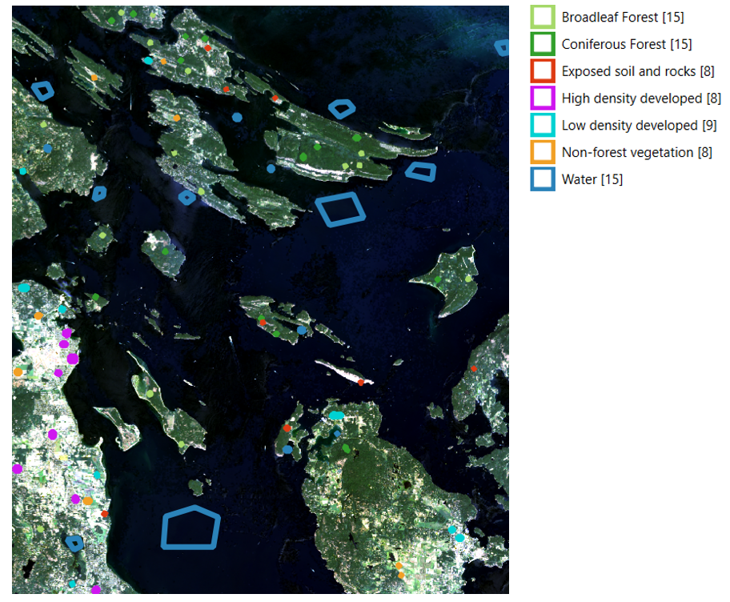
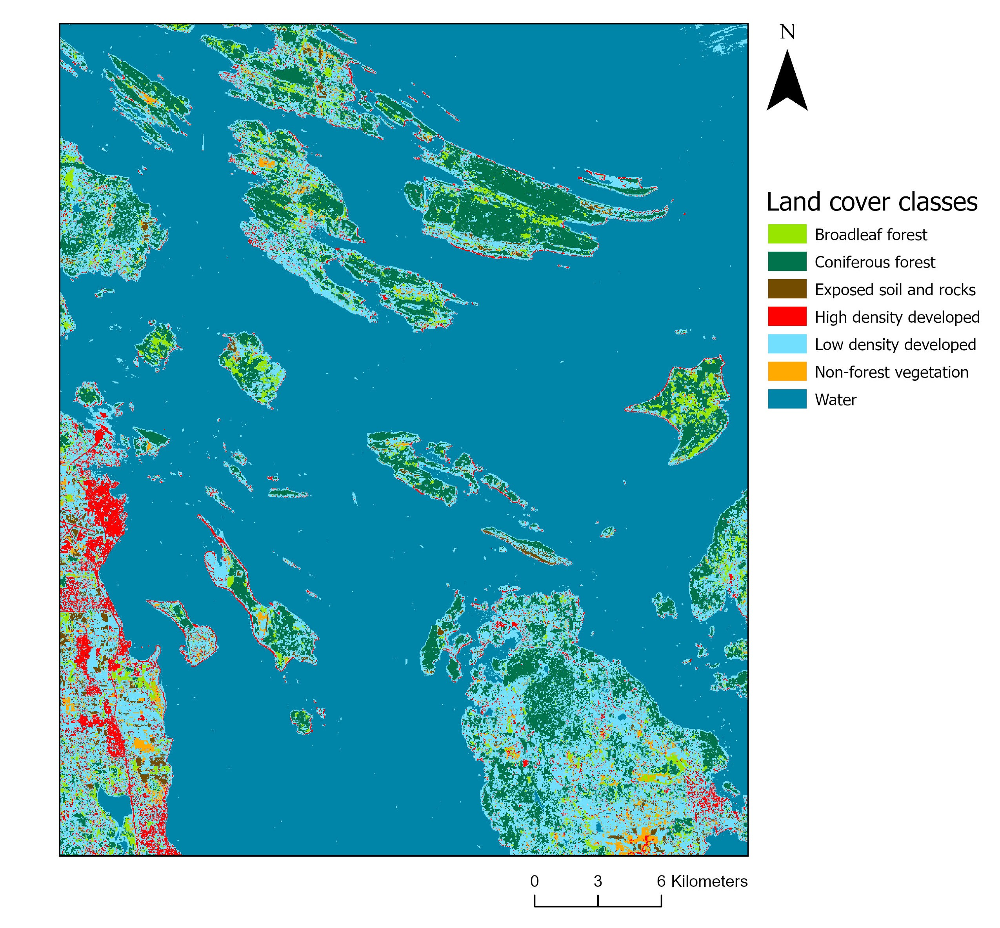
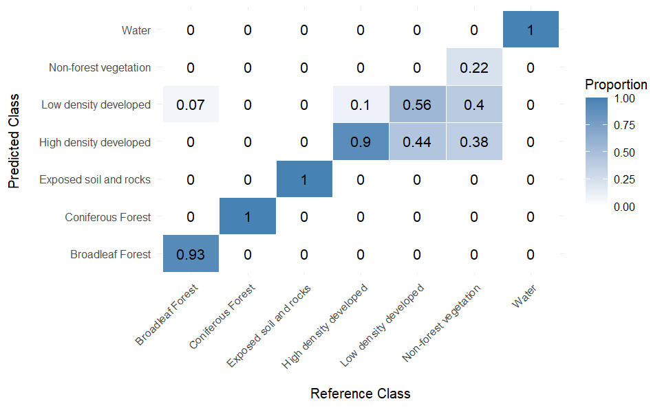
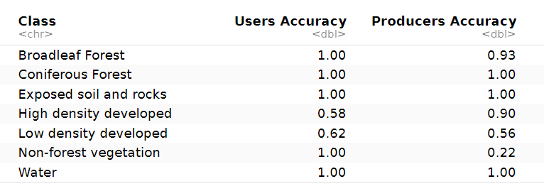

#### Overview

In this remote sensing lab, I performed a supervised classification of a Landsat 9 satellite image of the southern Gulf Islands in British Columbia to map different land cover types (broadleaf forest, coniferous forest, exposed soil and rocks, high-density developed areas, low-density developed areas, non-forest vegetation, and water). The workflow combined QGIS for training data collection and R for image classification and accuracy assessment.

#### Collecting Training Data

The first step was to collect training data so the classification algorithm could learn how to classify the remaining pixels in the image. This involved drawing boundaries in QGIS around sample areas representing each land-cover class, using a combination of false colour composites and satellite imagery to distinguish between classes. Each class included several training areas to represent the range of pixel values associated with that land cover across the image. Figure 1 shows an example of the polygon-drawing process in QGIS, with the accompanying legend summarizing the number of polygons assigned to each class.

 
<figcaption style="font-size:0.9em; margin-bottom:1.5em; display:block;">
  Figure 1. Delineation of training polygons in QGIS for seven land cover classes, showing the process of selecting Regions of Interest on the Landsat imagery.
</figcaption>


#### Assign training and validation polygons

The polygons were then imported into R and split into training and validation datasets. Seventy percent of the polygons for each land-cover class were used as training data for the classification algorithm, while the remaining 30% were reserved for validation to assess classification accuracy.

```{r, eval=FALSE}

# Assign a unique ID to each polygon 
class_poly <- tibble::rowid_to_column(class_poly, var = "ID")
# set.seed for random selection of polygons for training and validation
set.seed(1234)

# Sample 70% of the polygons in each land cover class
poly_train <- class_poly %>%
  group_by(lc_class) %>%
  sample_frac(0.7) %>%
  mutate(set = "training") %>% st_cast(to = 'POLYGON')

# Use the ID field to select the polygons for validation
poly_val <- class_poly %>%
  filter(!ID %in% poly_train$ID) %>%
  mutate(set = "validation") %>% st_cast(to = 'POLYGON')

# Combine training and validation data into 1 table
poly_set <- rbind(poly_train, 
                  poly_val)
```


#### Land Cover Classification


Next, the supervised classification was performed in R using the Maximum Likelihood Classification (MLC) algorithm. This method assigns each pixel in the image to the land-cover class for which it has the highest probability of belonging, based on the spectral signatures derived from the training polygons. Figure 2 shows the resulting map of classified land cover types.

```{r, eval=FALSE}

#classify land cover with maximum likelihood classification model
mlc_model <- superClass(img = ls_image, 
                        trainData = poly_train, 
                        valData = poly_val, 
                        responseCol = "lc_class", 
                        model = "mlc", 
                        nSamples = 500)
```


 
<figcaption style="font-size:0.9em; margin-bottom:1.5em; display:block;">
  Figure 2. Landsat 9 image of the southern Gulf Islands classified into seven land cover types using the Maximum Likelihood Classification algorithm in R.
</figcaption>


#### Accuracy Assessment

Figure 3 shows the confusion matrix, where the columns represent the reference classes and the rows represent the predictions from the classification model. The overall accuracy, as well as the User’s Accuracy (UA) and Producer’s Accuracy (PA) for each class, were calculated using the R code below. The classification achieved an overall accuracy of 96%, with the class-specific UA and PA metrics summarized in the table below.


<figcaption style="font-size:0.9em; margin-bottom:1.5em; display:block;">
  Figure 3. Confusion matrix showing the classification results. Columns represent the reference classes and rows represent the predicted classes. Values are proportions of pixels classified correctly for each class.
</figcaption>


```{r, eval=FALSE}
OA = sum(diag(conf_matrix))/sum(conf_matrix)
PA = diag(conf_matrix)/colSums(conf_matrix)
UA = diag(conf_matrix)/rowSums(conf_matrix)
```



<figcaption style="font-size:0.9em; margin-bottom:1.5em; display:block;">
  Table 1. Accuracy metrics for the supervised classification. User’s Accuracy (UA) indicates the proportion of correctly classified pixels for each predicted class, Producer’s Accuracy (PA) indicates the proportion of correctly classified pixels for each reference class
</figcaption>

  
