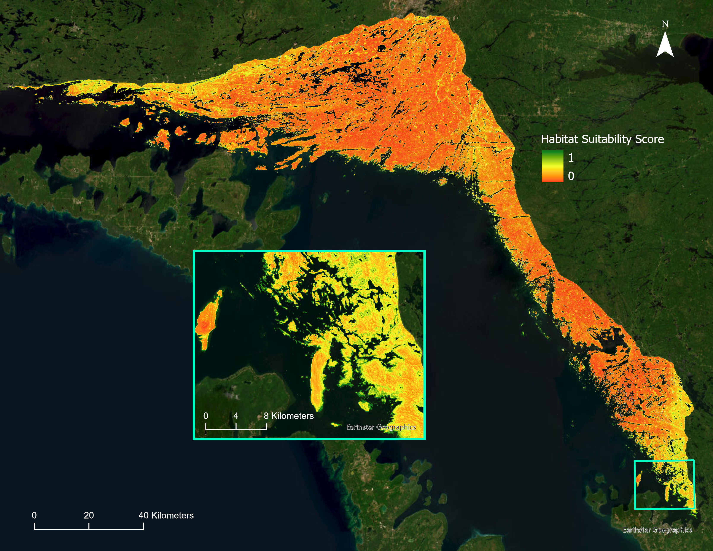
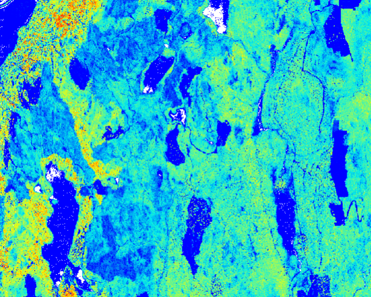
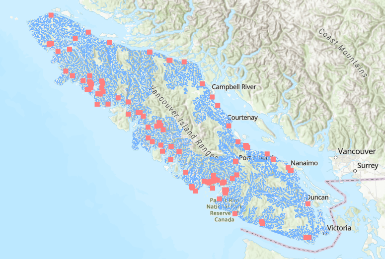

```{=html}
<style>
  .projects-grid {
    display: grid;
    grid-template-columns: repeat(auto-fill, minmax(280px, 1fr));
    gap: 1.75rem;
    padding: 2rem 0;
  }

  .project-card {
    display: flex;
    flex-direction: column;
    background: #ffffff;
    border-radius: 8px;
    overflow: hidden;
    text-decoration: none;
    color: inherit;
    border: 1px solid #e4e4e1;
    box-shadow: 0 2px 8px rgba(0,0,0,0.04);
    transition: transform 0.28s ease, box-shadow 0.28s ease, border-color 0.28s ease;
    cursor: pointer;
  }

  .project-card:hover {
    transform: translateY(-6px);
    box-shadow: 0 14px 36px rgba(94,148,112,0.13);
    border-color: #5e9470;
  }

  .card-image-wrap {
    position: relative;
    width: 100%;
    aspect-ratio: 4 / 3;
    overflow: hidden;
    background: #e8e8e4;
  }

  .card-image-wrap img {
    width: 100%;
    height: 100%;
    object-fit: cover;
    display: block;
    transition: transform 0.4s ease;
  }

  .project-card:hover .card-image-wrap img {
    transform: scale(1.04);
  }

  .card-tag {
    position: absolute;
    top: 0.85rem;
    left: 0.85rem;
    background: rgba(94,148,112,0.88);
    color: #fff;
    font-size: 0.65rem;
    font-weight: 600;
    letter-spacing: 0.12em;
    text-transform: uppercase;
    padding: 0.3rem 0.65rem;
    border-radius: 4px;
    backdrop-filter: blur(4px);
  }

  .card-placeholder {
    width: 100%;
    height: 100%;
    display: flex;
    align-items: center;
    justify-content: center;
    background: linear-gradient(135deg, #e8e8e4 0%, #ddddd8 100%);
  }
  .card-placeholder svg { opacity: 0.28; }

  .card-body {
    padding: 1.1rem 1.3rem 1.3rem;
    display: flex;
    flex-direction: column;
    gap: 0.4rem;
  }

  .card-title {
    font-size: 1.05rem;
    font-weight: 600;
    color: #222;
    line-height: 1.3;
    margin: 0;
  }

  .card-desc {
    font-size: 0.865rem;
    color: #777;
    line-height: 1.65;
    margin: 0;
  }

  .card-cta {
    display: inline-flex;
    align-items: center;
    gap: 0.35rem;
    margin-top: 0.5rem;
    font-size: 0.72rem;
    font-weight: 600;
    letter-spacing: 0.08em;
    text-transform: uppercase;
    color: #5e9470;
    text-decoration: none;
    transition: color 0.2s, gap 0.2s;
  }

  .project-card:hover .card-cta {
    color: #4a7a5c;
    gap: 0.6rem;
  }

  @keyframes fadeUp {
    from { opacity: 0; transform: translateY(16px); }
    to   { opacity: 1; transform: translateY(0); }
  }
  .project-card:nth-child(1) { animation: fadeUp 0.5s ease 0.05s both; }
  .project-card:nth-child(2) { animation: fadeUp 0.5s ease 0.15s both; }
  .project-card:nth-child(3) { animation: fadeUp 0.5s ease 0.25s both; }

  @media (max-width: 500px) {
    .projects-grid { grid-template-columns: 1fr; }
  }
</style>

<div class="projects-grid">

  <!-- Card 3 -->
  <a class="project-card" href="Assignment3.html">
    <div class="card-image-wrap">
      
      <div class="card-placeholder" style="display:none">
        <svg width="48" height="48" viewBox="0 0 24 24" fill="none" stroke="#555" stroke-width="1.2">
          <rect x="3" y="3" width="18" height="18" rx="2"/>
          <circle cx="8.5" cy="8.5" r="1.5"/><polyline points="21 15 16 10 5 21"/>
        </svg>
      </div>
      <span class="card-tag">Research</span>
    </div>
    <div class="card-body">
      <h3 class="card-title">Masters Capstone Project</h3>
      <p class="card-desc">Mapping the suitability of Stiff Yellow Flax across Eastern Georgian Bay</p>
      <span class="card-cta">View project →</span>
    </div>
  </a>

  <!-- Card 1 -->
  <a class="project-card" href="Assignment1.html">
    <div class="card-image-wrap">
      
      <div class="card-placeholder" style="display:none">
        <svg width="48" height="48" viewBox="0 0 24 24" fill="none" stroke="#555" stroke-width="1.2">
          <rect x="3" y="3" width="18" height="18" rx="2"/>
          <circle cx="8.5" cy="8.5" r="1.5"/><polyline points="21 15 16 10 5 21"/>
        </svg>
      </div>
      <span class="card-tag">Remote Sensing</span>
    </div>
    <div class="card-body">
      <h3 class="card-title">Lidar Processing & Forest Attribute Modelling</h3>
      <p class="card-desc">Processing Lidar point clouds to create wall to wall predictions of forest attributes.</p>
      <span class="card-cta">View project →</span>
    </div>
  </a>

  <!-- Card 2 -->
  <a class="project-card" href="Assignment2.html">
    <div class="card-image-wrap">
      
      <div class="card-placeholder" style="display:none">
        <svg width="48" height="48" viewBox="0 0 24 24" fill="none" stroke="#555" stroke-width="1.2">
          <rect x="3" y="3" width="18" height="18" rx="2"/>
          <circle cx="8.5" cy="8.5" r="1.5"/><polyline points="21 15 16 10 5 21"/>
        </svg>
      </div>
      <span class="card-tag">GIS</span>
    </div>
    <div class="card-body">
      <h3 class="card-title">Salmon Stream Network Analysis</h3>
      <p class="card-desc">Determining stream reachability, barriers, and accessible habitat within the Chinook salmon conservation unit.g.</p>
      <span class="card-cta">View project →</span>
    </div>
  </a>

</div>
```